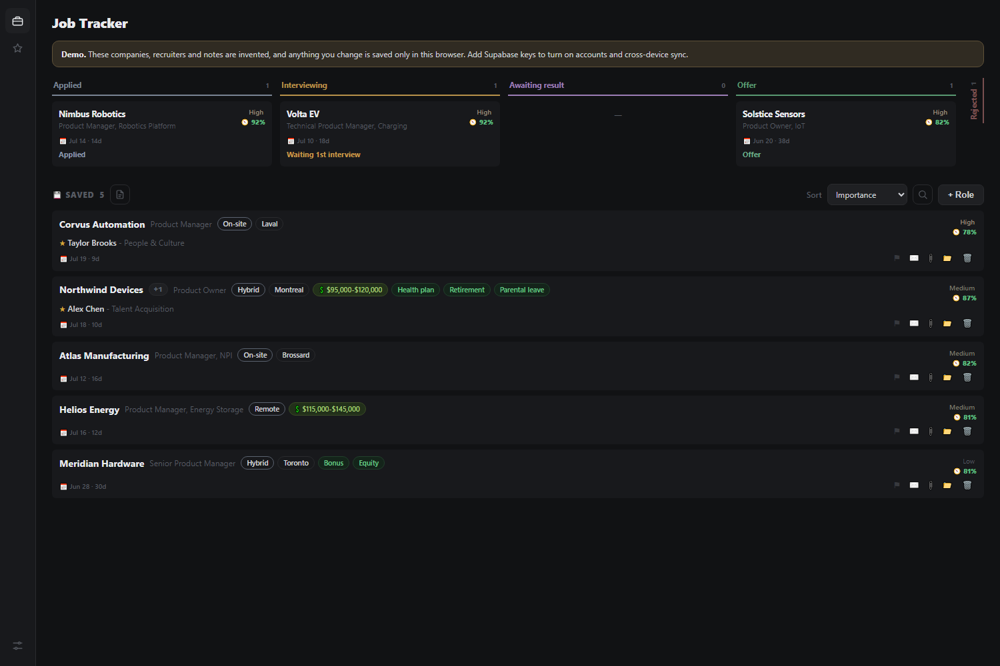
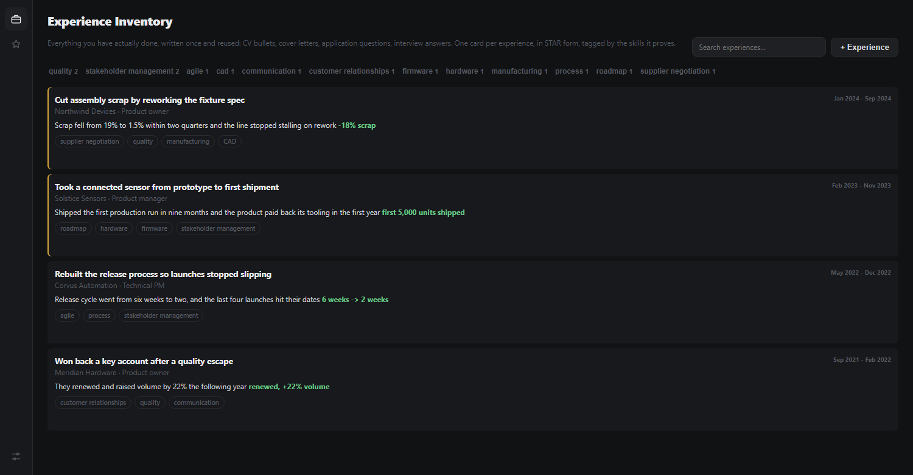

# Job Search

A job hunt is two jobs: running the pipeline, and rewriting your CV for every posting. This app
does both, in one file that opens in a browser. No build step, no backend required.

**Live demo:** https://dereckcb.github.io/job-search/ - the companies, recruiters and experiences
are invented, and anything you change stays in your own browser.

---

## The two pages

The left rail has one icon per page. Hover an icon to see its name.

### 1. Job Tracker - the pipeline

Every role you are chasing, in one board.

- **Kanban by stage** across the top: Applied, Interviewing, Awaiting result, Offer, with Rejected
  collapsed to a strip on the right so it stays out of the way. Drag a card to move it along.
- **Saved backlog** underneath: roles you found but have not applied to yet, **grouped by company**.
  If a company has three openings you get one card with a `+2` badge instead of three rows; flag the
  one that best represents the company and it becomes the card you see.
- **Fit score** - the coloured percentage on each card. It compares the posting against your skills
  three ways: how much of what they ask for you actually have, whether the seniority matches, and
  whether the role and industry are your kind of work. Hover it for the breakdown and the list of
  what you are missing.
- **Contacts per role**, in order: the person at the top is your principal contact and shows with a
  star. Moving a role to *Applied* asks who you contacted and when, so a follow-up is never lost.
- **What the job offers**, not what it demands: the chips on a card are work mode, location, salary
  and the perks worth knowing about.
- **Notes, posting link, full description, dates**, and an archive drawer for the roles you drop.
- **Find roles**: an optional web search for new openings that fit, run through your own LLM API key
  (kept in your browser only), or copy the research prompt and run it wherever you like.

### 2. Experience Inventory - your master CV

**This is what makes the tailoring possible.** Instead of one CV file you keep editing into
oblivion, you keep a **library of everything you have actually done** - one card per project,
achievement or piece of work - and assemble a CV per application out of it.

Each entry holds:

| Field | Why it is there |
|---|---|
| Headline | what you did, in one line |
| Where and when | company or project, your role, the months |
| **Situation, Task, Action, Result** | the STAR story, written properly once |
| **Impact metric** | the number that proves it (`-18% scrap`, `6 weeks -> 2 weeks`) |
| **Skills it proves** | tags that make it findable - they become the filters |
| Notes | where the proof is, numbers to double-check, who else was involved |

What having it gives you:

- **Search and filter by skill.** A posting wants supplier negotiation and roadmap work? Filter by
  those tags and you are looking at exactly the experiences worth putting on that CV.
- **Star your strongest** - they sort to the top, so what you lead with is always at hand.
- **Copy a CV line** from any card in one click. It comes out result-first with the metric in
  parentheses, the way a bullet should read, ready to paste.
- **Build a tailored CV per posting.** From a job card, the CV button assembles a prompt combining
  the role, its description and your inventory, and hands it to whichever AI assistant you use.
  **The rules are yours**: what to emphasise, what to leave out, tone, length, how many bullets per
  role. Set them once and every CV comes out consistent instead of improvised.
- **It doubles as interview prep.** The STAR fields are your answer to "tell me about a time when",
  written while you still remembered the details.

Nothing here is generated for you. The inventory is what *you* did; the app makes it reusable.

---

## Under the hood

- One HTML file. Open it and it runs - no install, no server, no network needed.
- Everything saves to your browser under `jobs_state`. Settings has a JSON **Backup** and
  **Restore**, and a rolling ring of the last 15 states as a safety net.
- Optional: add Supabase keys at the top of the script and it switches on accounts, cross-device
  sync and versioned history. Without keys it stays in demo mode - no login, no network. See
  `SETUP.md`.
- Light and dark, and it works on a phone.

## Part of a set

Small, separate apps that share a look but nothing else - separate data, separate repos:

| App | Repo |
|---|---|
| Task Tracker | https://github.com/DereckCB/task-tracker |
| Job Search | this one |
| Trip Planner | https://github.com/DereckCB/trip-planner |
| Household Budget | https://github.com/DereckCB/budget |

## License

MIT (c) 2026 Dereck Barinotto
