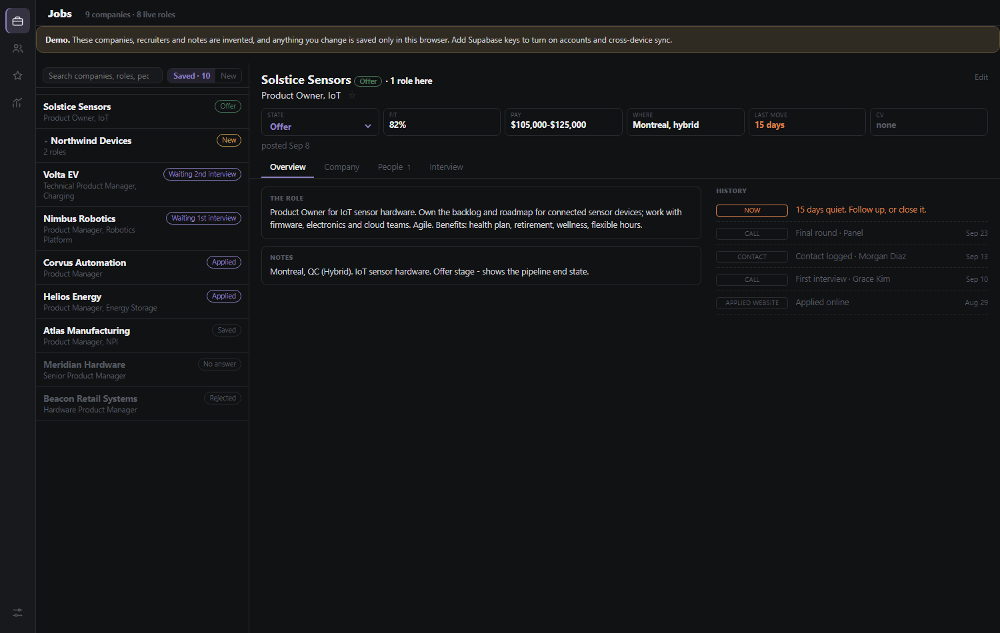
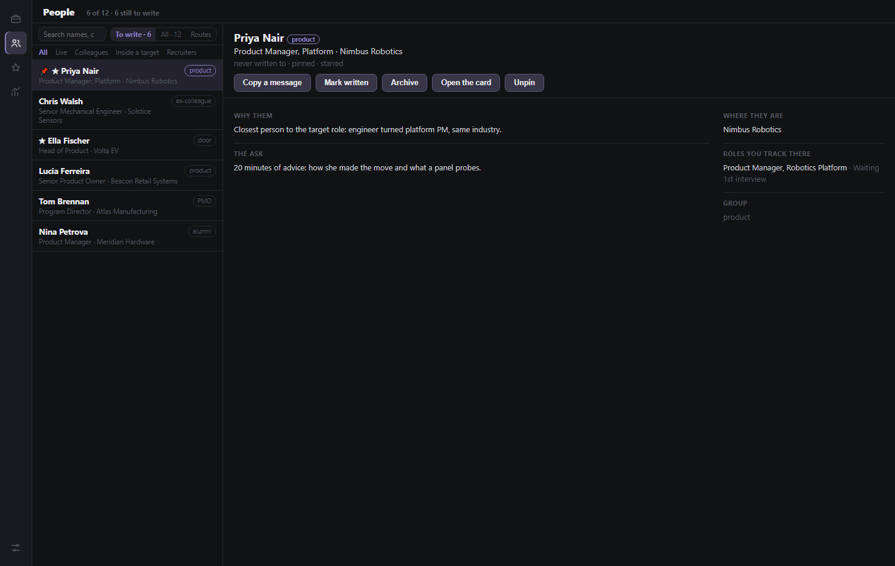
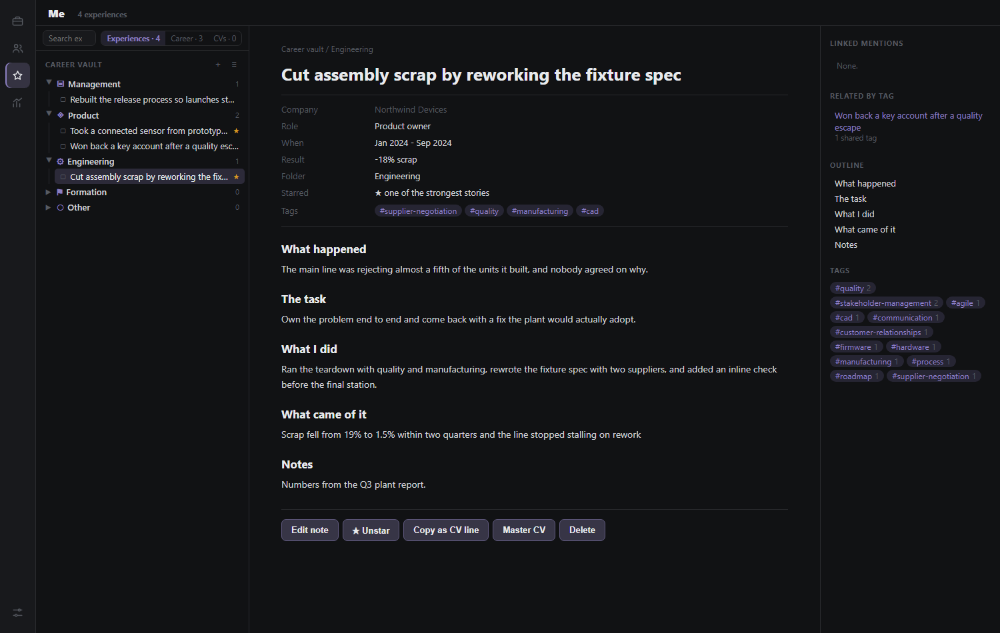
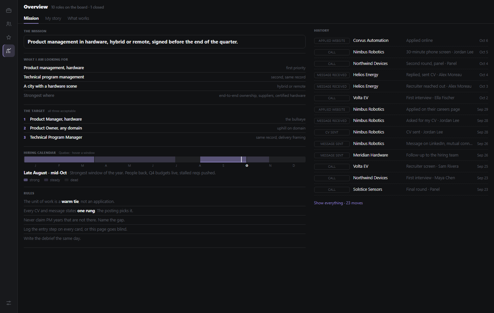

# Job Search

A job hunt is two jobs: running the pipeline, and rewriting your CV for every posting. This app
does both, in one file that opens in a browser. No build step, no backend required.

**Live demo:** https://dereckcb.github.io/job-search/ - the companies, recruiters and experiences
are invented, and anything you change stays in your own browser.

---

## The pages

The left rail has one icon per page. Hover an icon to see its name.

### 1. Jobs - the pipeline

Every company you are chasing in one list, and the one you pick opened on the right.

- **One row per company**, with its live state (applied, waiting on a first or second interview,
  offer, no answer, rejected). Several openings at the same company stay under one row.
- **The card**: state, **fit score**, pay, where and how you would work, how long since the last move,
  and the CV you sent. Tabs for the **company**, the **people** you know there and **interview** prep.
- **The history of each application, step by step**: applied online, a message, a referral, a call,
  each interview, who it was with and when. When nothing has moved for a while it says so: follow
  up, or close it.

### 2. People - who can land it

A job hunt is won through people. This page is a queue, not a contact list:

- **To write**: one person at a time, with **why them** and **the ask**. Copy a drafted message, mark
  it written, archive it, and the next name moves up.
- **Groups**: live threads, ex-colleagues, people inside a target company, product managers, alumni,
  recruiters. **Routes** shows every way into each company.
- Each person links to the roles you track at their company.

### 3. Me - the career vault

**This is what makes tailoring a CV possible.** Instead of one CV you keep editing, you keep a
**library of everything you have actually done**, one note per story, and build each CV out of it.

- Each story holds the company, your role, the dates, **what happened, the task, what you did and
  what came of it**, the number that proves it, and tags.
- Stories sort into folders (management, product, engineering, training) and link to each other by
  shared tags. **Star** the strongest ones.
- **Career** lists every role with what you did there; **CVs** shows which CV went where.
- **Copy as CV line** turns a story into a bullet, result first. The master CV stays the source of truth.

### 4. Overview - is the search working?

- **Mission**: the one-line goal, what you are looking for, the target roles in order, a **hiring
  calendar** marking the strong and dead windows of the year, your rules, and the **history** of every
  move across the whole board.
- **My story**: the one-liner, three proofs and the objection you always get, all editable.
- **What works**: the **funnel** computed off the board, which **channels** led somewhere, what is
  leaking, what is working and what is not.

### 5. Job Board - new roles, scanned for you

A live scan of public career sites (Workday, Greenhouse, Lever, Ashby, SmartRecruiters, Workable)
and remote job boards, plus Adzuna once you add your own free keys. Every posting is **scored against
your record**: title, place, level and the gaps it would expose. Filter by role, where and when it was
posted, dismiss what is not for you, and save the good ones straight onto the Jobs page. Add any
company by pasting its careers page link.

---

## Under the hood

- One HTML file. Open it and it runs - no install, no server, no network needed.
- Everything saves to your browser under `jobs_state`. Settings has a JSON **Backup** and
  **Restore**, and a rolling ring of the last states as a safety net.
- Optional: add Supabase keys at the top of the script and it switches on accounts, cross-device
  sync and versioned history. Without keys it stays in demo mode - no login, no network. See
  `SETUP.md`.
- Light and dark, and it works on a phone.

## Part of a set

Small, separate apps that share a look but nothing else - separate data, separate repos:

| App | Repo |
|---|---|
| Task Tracker | https://github.com/DereckCB/task-tracker |
| Job Search | this one |
| Trip Planner | https://github.com/DereckCB/trip-planner |
| Household Budget | https://github.com/DereckCB/household-budget |

## License

MIT (c) 2026 Dereck Barinotto
